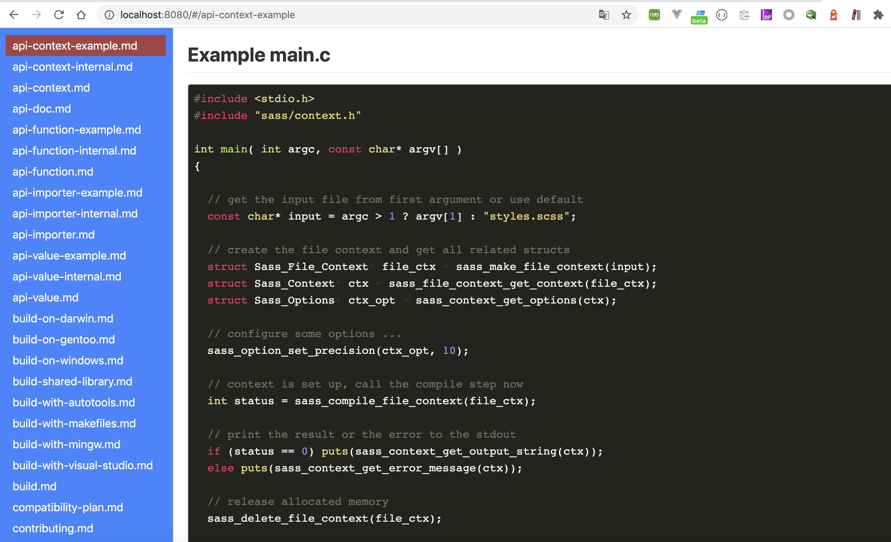
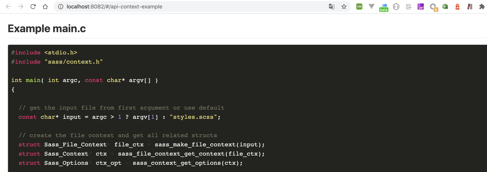

# md-online: a command-line md server

`md-online` is a simple, zero-configuration command-line markdown file server. It's simple and hackable enough to be used for reading.

## Installation:

#### Globally via `npm`

    npm install --global md-online
     
#### As a dependency in your `npm` package:

    npm install md-online

## Usage:

     md-online [options]

`[path]` defaults to `./`.

*Now you can visit http://localhost:8080 to view your server*


### Available Options:

`-p` or `--port` Port to use (defaults to 8080).

`-h` or `--help` Print this list and exit.

`-f` or `--file` Open a markdown file.

`-l` or `--list` Generate with list.(defaults  without the list of file)

`-v` or `--version` Print the version and exit.


## Example

Open terminal in a folder, and then try

```sh
$ md-online -p 8080 -l
```



or 
```sh
$ md-online -f xxx.md
```




*Now you can visit http://localhost:8080 to view markdown file in your folder*


## Personalisation
> Now , it's supported on Linux and Mac platform, and will fix it on Windows platform no soon

## References
+ [marked](https://www.npmjs.com/package/marked)